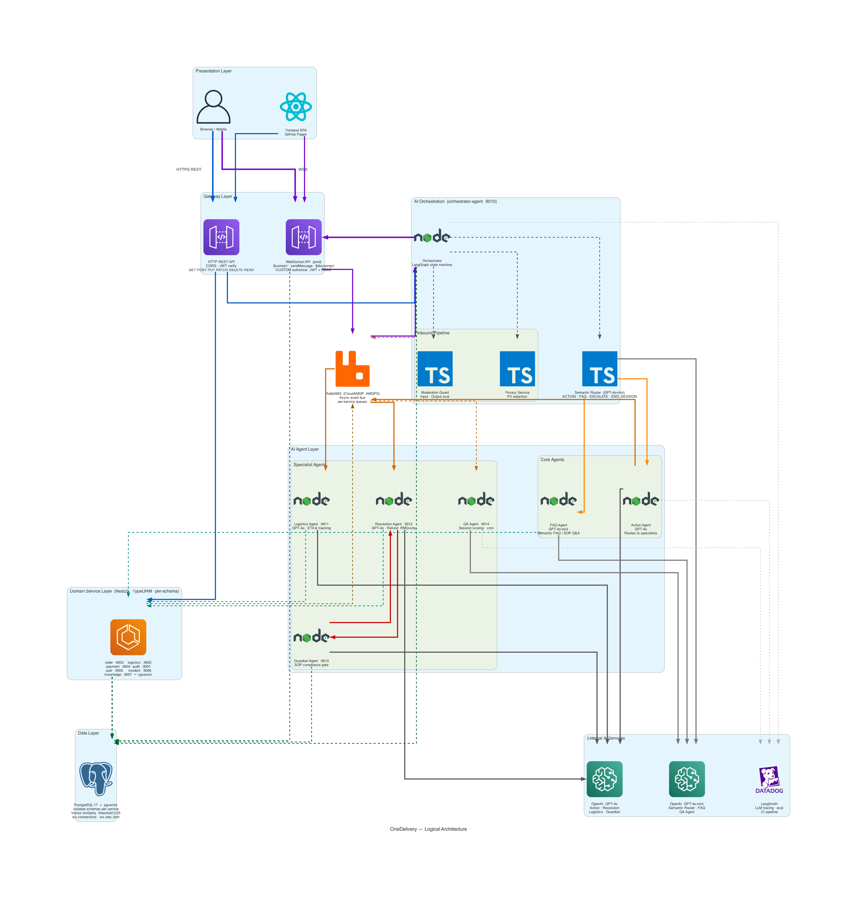
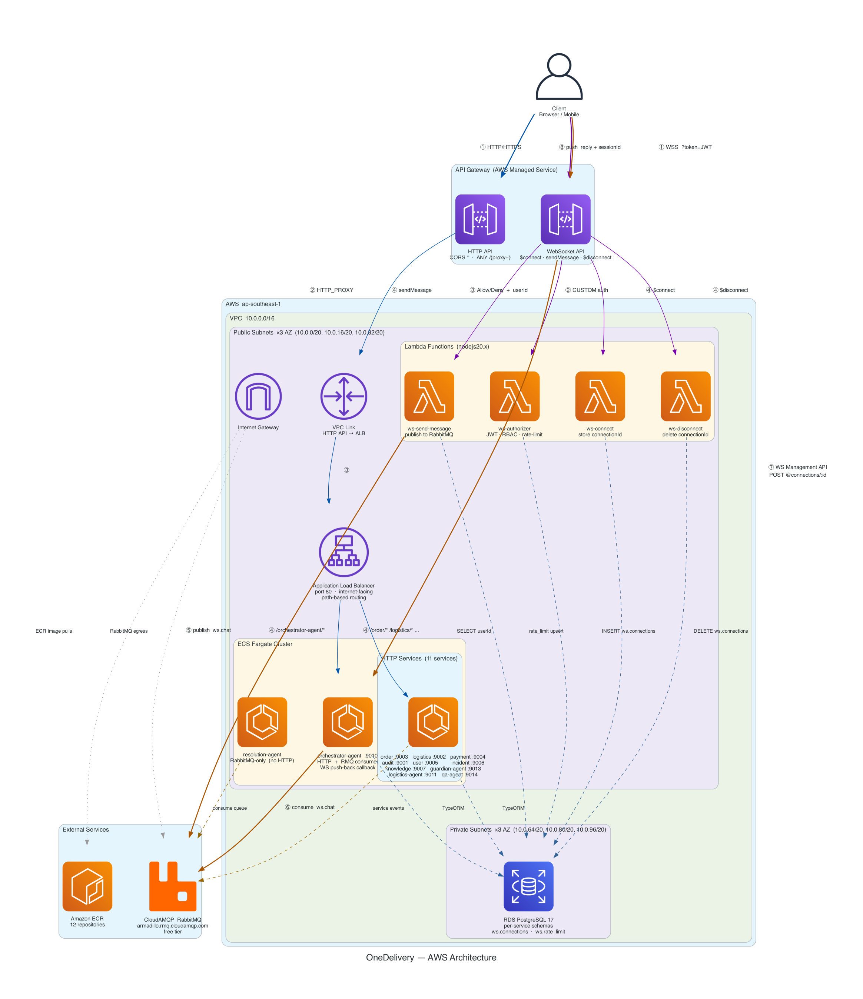

# OneDelivery — Agentic AI for Customer Service
### NUSISS Practice Module | Architecting AI Systems
**Team: Yihang Chia**

<!--
DESIGN INSTRUCTIONS — apply these to every slide:

Color Palette (ocean blue gradient — use consistently across all slides):
  Primary / backgrounds:  #03045E (navy)   #023E8A (dark blue)
  Accents / headings:     #0077B6 (medium blue)   #0096C7 (ocean blue)
  Highlights / badges:    #00B4D8 (cyan blue)   #48CAE4 (light cyan)
  Subtle fills / borders: #90E0EF (pale cyan)   #ADE8F4 (very light blue)
  Slide background tint:  #CAF0F8 (near-white blue)

Usage guidance:
- Slide background: #CAF0F8 or white with #03045E text
- Section headers / title bars: #03045E or #023E8A fill, white text
- Accent bars, icons, callout boxes: #0077B6 or #0096C7
- Table header rows: #00B4D8 fill, white text
- Highlighted keywords / badges: #48CAE4 background, #03045E text
- Borders, dividers, subtle elements: #90E0EF or #ADE8F4
- Charts / diagrams: use the full 9-color ramp as a sequential scale
-->

---

## 1. Introduction
### Project Objective & Scope

**Problem:** Customer service teams are overwhelmed with repetitive refund, logistics, and order queries — manual resolution is slow, inconsistent, and hard to scale.

**Objective:** Build a production-grade agentic AI system that autonomously handles customer service interactions for a delivery platform — from intent classification to action execution and quality assurance.

**Scope:**
- 12 microservices: Order, Logistics, Payment, Audit, Incident, Knowledge, User + 5 AI Agents
- Full e2e flow: customer chat → AI routing → automated resolution → audit trail
- Deployed on AWS ECS Fargate with CI/CD pipeline

---

## 1b. How Agents Work Together
### High-Level Workflow

```
Customer Message
      ↓
Orchestrator Agent  ←── LangGraph State Machine
      ↓
Semantic Router  ──→  ACTION / FAQ / ESCALATE / END_SESSION
      ↓                        ↓
Action Agent              FAQ Agent
(GPT-4o)                 (GPT-4o-mini)
      ↓                        ↓
Guardian Agent         Knowledge Service
(SOP compliance)       (pgvector semantic search)
      ↓
Logistics Agent / Resolution Agent
      ↓
QA Agent  ←── Post-session quality scoring (async)
```

Each agent has a defined role, tools, and memory — they hand off via RabbitMQ and never share a database schema.

---

## 2. Overall Effort to Date
### Estimate vs Actual

| Area | Estimated | Actual | Notes |
|---|---|---|---|
| Microservices setup (12 services) | 3 days | 4 days | RabbitMQ + TypeORM config overhead |
| AI Agent implementation | 4 days | 5 days | LangGraph state machine complexity |
| Infrastructure (Terraform + AWS) | 2 days | 3 days | API Gateway path routing, VPC issues |
| CI/CD pipeline | 1 day | 1.5 days | SonarQube matrix, ECR permissions |
| Database seeding + migrations | 1 day | 1 day | SSL + schema isolation |
| LangSmith evaluations | 1 day | 2 days | In-process eval pattern with mocks |
| Testing (unit + integration) | 2 days | 2 days | On track |
| **Total** | **14 days** | **18.5 days** | ~32% overrun |

**Key overruns:** LangGraph complexity, AWS networking (VPC Link → direct ALB DNS pivot), ECS Exec SSM permissions debugging.

---

## 3. System Architecture
### Logical Architecture



**Layer breakdown (top → bottom):**
- **Presentation** — Browser/Mobile + React SPA (GitHub Pages)
- **Gateway** — HTTP REST API (CORS, JWT) + WebSocket API (JWT + RBAC authorizer)
- **AI Orchestration** — Orchestrator Agent (LangGraph) with Privacy Service, Moderation Guard, Semantic Router
- **AI Agent Layer** — Core: Action Agent (GPT-4o), FAQ Agent (GPT-4o-mini); Specialist: Logistics, Resolution, Guardian, QA
- **Domain Services** — 7 NestJS services, TypeORM, per-service schema
- **Data** — RabbitMQ event bus + PostgreSQL 17 + pgvector
- **External AI** — OpenAI GPT-4o / GPT-4o-mini, LangSmith tracing

**Design Patterns:** Saga (refund resolution), Publisher/Subscriber (RabbitMQ event bus), Chain of Responsibility (Router → Agent → Guardian → Service)

---

## 3b. Physical Architecture
### Infrastructure Diagram



**Key flows:**
- **Blue** — HTTPS REST: Browser → HTTP API GW → ALB → ECS services (path-based)
- **Purple** — WebSocket: Browser → WS API GW → Lambda Authorizer → RabbitMQ → Orchestrator → push reply
- **Orange** — Agentic routing: Orchestrator → RabbitMQ → Logistics / Resolution / QA agents
- **Red** — Guardian SOP gate: Resolution Agent ↔ Guardian Agent
- **Green dashed** — TypeORM + pgvector → RDS PostgreSQL 17 (private subnets)

**AWS Services:** ECS Fargate, ALB, API Gateway v2 (HTTP + WebSocket), Lambda (nodejs20.x), RDS PostgreSQL 17, ECR, CloudWatch, SSM (ECS Exec)

---

## 3c. Deployment Strategy & Tech Choices
### Containerization & Cloud

**Containerization:**
- Single `Dockerfile.template` with `SERVICE_NAME` + `EXPOSE_PORT` build args
- All 12 services built from same template — consistent base, isolated ports
- Images tagged with Git SHA for traceability; `:latest` also updated

**Deployment:**
- ECS Fargate — serverless containers, scale-to-zero for cost optimisation
- No EC2 to manage; task definitions generated per service in CI/CD
- `enable_execute_command = true` for ECS Exec debugging

**Justification of Architectural Choices:**
- **NestJS monorepo**: Shared libs (`@libs/modules`), consistent DI, TypeORM per service
- **RabbitMQ over REST**: Decoupled async communication; agents don't block waiting for domain services
- **pgvector over external vector DB**: Keeps semantic search co-located with relational data; simpler ops
- **API Gateway + ALB**: API Gateway handles CORS and auth edge; ALB handles path-based internal routing

---

## 3d. Tech Stack

| Layer | Technology |
|---|---|
| Backend Framework | NestJS (TypeScript) monorepo |
| AI/LLM | LangChain + LangGraph, GPT-4o, GPT-4o-mini |
| Vector Search | PostgreSQL 17 + pgvector |
| Event Bus | RabbitMQ (AMQP) |
| Database ORM | TypeORM |
| Infrastructure | AWS ECS Fargate, ALB, API Gateway v2, RDS, ECR |
| IaC | Terraform |
| API Gateway (local) | Kong |
| CI/CD | GitHub Actions |
| Security Scan | Trivy (container), SonarQube (SAST) |
| Observability | LangSmith (LLM eval), CloudWatch |
| Auth | JWT (RS256), bcrypt |

---

## 4. Agent Design
### Orchestrator Agent

**Purpose:** Entry point for all customer interactions. Coordinates the entire agentic pipeline.

**Responsibilities:**
- Receive customer messages via REST API
- Invoke Semantic Router to classify intent
- Dispatch to Action Agent or FAQ Agent based on intent
- Apply PII redaction before any LLM call
- Apply moderation guards (input validation + output evaluation)
- Publish completed sessions to QA Agent

**Planning/Reasoning:** LangGraph state machine — deterministic transitions between ROUTE → ACT/FAQ → GUARDIAN → RESPOND states

**Memory:** `MemoryService` maintains conversation history per session (in-memory, keyed by sessionId)

**Tools:** `Route_To_Logistics`, `Route_To_Resolution`, `End_Chat_Session`, `Escalate_To_Human`

---

## 4b. Agent Design
### Logistics Agent & Resolution Agent

**Logistics Agent**
- Purpose: Handle shipment tracking, ETA queries, delay prediction
- Reasoning: GPT-4o with logistics-domain prompt; queries Logistics service via RMQ
- Memory: Stateless — context passed in per call
- Tools: `Get_Order_Status`, `Get_Shipment_ETA`, `Predict_Delay`

**Resolution Agent**
- Purpose: Process refund requests end-to-end
- Reasoning: GPT-4o evaluates refund eligibility against SOP rules; returns structured JSON `{status, orderId, amount/reason, summary}`
- Memory: Stateless per session; SOP context loaded from Knowledge service via pgvector
- Tools: `Check_Refund_Eligibility`, `Process_Refund`, `Query_SOP_Knowledge`
- Auto-approves refunds ≤ $20; escalates higher amounts to Guardian

---

## 4c. Agent Design
### Guardian Agent & QA Agent

**Guardian Agent**
- Purpose: SOP compliance gate — verifies all actions before execution
- Reasoning: Reviews proposed action against retrieved SOP rules; approves or rejects with explanation
- Memory: None — stateless verifier
- Tools: `Retrieve_SOP_Rules` (pgvector semantic search), `Approve_Action`, `Reject_Action`
- All resolution actions pass through Guardian; 3 rejection cycles → human escalation

**QA Agent**
- Purpose: Post-session quality analysis and trend detection
- Reasoning: Scores sessions on resolution accuracy, SOP compliance, customer sentiment, response quality
- Memory: Aggregates session scores for trend analysis via `@nestjs/schedule` cron
- Tools: `Score_Session`, `Detect_Trends`, `Flag_Incidents`
- Receives sessions fire-and-forget via `End_Chat_Session` tool

---

## 5. Explainable & Responsible AI Practices

**Alignment with XAI/RAI Principles:**

| Principle | Implementation |
|---|---|
| Explainability | Structured JSON responses include `summary` field explaining every decision |
| Transparency | LangSmith traces all LLM calls; full audit trail in Audit service |
| Fairness | SOP-grounded responses — decisions based on rules, not LLM opinion |
| Privacy | `PrivacyService` redacts PII (name, email, phone, NRIC) before LLM call |
| Human Oversight | Guardian blocks non-compliant actions; human escalation path always available |
| Accountability | Every interaction logged with sessionId, userId, agent decisions, timestamps |

**Bias Mitigation:** SOP retrieval via pgvector anchors responses to documented policy — reduces model hallucination and inconsistent treatment across customers.

---

## 5b. Responsible AI — Governance Framework
### IMDA Model AI Governance Alignment

| IMDA Framework Principle | OneDelivery Implementation |
|---|---|
| Internal Governance | Agent role separation — no single agent has unrestricted authority |
| Decision-Making with Human Involvement | Guardian gate + human escalation for edge cases |
| Operations Management | LangSmith evals, CloudWatch monitoring, QA Agent scoring |
| Stakeholder Interaction | Transparent summaries in all agent responses; audit trail accessible |

**Responsible AI by Design:**
- Moderation service validates inputs (jailbreak detection) and evaluates outputs (hallucination check)
- No PII reaches the LLM — redacted in-process before API call
- All SOP knowledge is human-authored and version-controlled

---

## 6. AI Security Risk Register

| Risk | Severity | Mitigation |
|---|---|---|
| Prompt Injection | High | Input moderation service; system prompt isolation; output evaluation |
| PII Leakage to LLM | High | PrivacyService redacts before every LLM call |
| Jailbreak / Role Confusion | High | System prompt hardening; moderation guard rejects out-of-scope inputs |
| Hallucinated SOP Decisions | Medium | pgvector retrieval grounds responses; Guardian verifies against source SOP |
| Excessive LLM Authority | Medium | Tool-based architecture — LLM can only call defined tools, not arbitrary code |
| API Key Exposure | Medium | Keys in AWS Secrets Manager; never in code or logs |
| Model Denial-of-Service | Low | Rate limiting at API Gateway; preflight checks reduce wasted LLM calls |
| Supply Chain (LLM Provider) | Low | Abstract LLM behind LangChain; provider can be swapped without app changes |

**Security Tools:** Trivy (container image scanning in CI), SonarQube (SAST), JWT auth on all endpoints

---

## 7. Application Demo
### Live Walkthrough

**Demo Flow:**
1. Customer login → POST `/user/auth/login`
2. Start chat session → POST `/orchestrator-agent/chat`
3. Send refund request → Semantic Router classifies as ACTION
4. Action Agent routes to Resolution Agent via RabbitMQ
5. Guardian Agent reviews SOP compliance → approves
6. Refund processed → structured JSON response returned
7. Session ends → QA Agent scores quality async

**Key Demo Scenarios:**
- Happy path: ≤$20 refund auto-approved
- Edge case: >$20 refund blocked by Guardian, escalated
- FAQ query: pgvector semantic search returns grounded SOP answer
- PII test: customer sends personal data — redacted before LLM

---

## 8. MLSecOps / LLMSecOps Pipeline
### CI/CD Security Pipeline

```
Push to GitHub
      ↓
[Stage 1 — CI]
  ├── Trivy container vulnerability scan
  ├── ESLint code quality check
  ├── NestJS build validation (all 12 services)
  ├── LangSmith evaluations (gated: ENABLE_LANGSMITH_EVALUATOR)
  │     └── Orchestrator, QA, Logistics, Resolution agent evals
  └── SonarQube SAST scan (matrix parallel, 3-attempt retry)
      ↓
[Stage 2 — Build & Push]  (main branch only)
  ├── Build Docker images (SERVICE_NAME + EXPOSE_PORT args)
  ├── Tag with Git SHA + :latest
  └── Push to AWS ECR
      ↓
[Stage 3 — Deploy]
  ├── Generate ECS task definition per service
  ├── Deploy to ECS Fargate (matrix parallel)
  └── Force-new-deployment to pull fresh images
```

**LLMSecOps additions:** LangSmith evals gate merges; eval scripts run in-process with mocked dependencies for deterministic scoring.

---

## 9. Testing Summary
### Test Coverage & Results

| Test Type | Scope | Tool | Status |
|---|---|---|---|
| Unit Tests | Service logic, prompt builders, parsers | Jest | Passing |
| Integration Tests | RabbitMQ message flow, TypeORM queries | Jest + Supertest | Passing |
| Security Scan | Container images (CVEs) | Trivy | No critical CVEs |
| SAST | TypeScript source code | SonarQube | No blocker issues |
| LLM Evaluation | Agent accuracy, intent classification | LangSmith | Eval suite active |
| E2E Tests | Full chat session flow | Supertest | Core scenarios covered |

**LangSmith Eval Results:**
- Orchestrator intent classification accuracy: correct routing on standard scenarios
- Guardian compliance detection: blocks non-SOP actions reliably
- QA Agent scoring: consistent session quality scores vs ground truth
- Resolution Agent: structured JSON output with correct orderId threading

---

## Thank You
### OneDelivery — Built with NestJS · LangChain · AWS · pgvector

**Summary of What Was Built:**
- Agentic AI system with deterministic guardrails, not just LLM reasoning
- 12 production-grade microservices on AWS Fargate with full CI/CD
- SOP-grounded knowledge retrieval via pgvector — reduces hallucination
- Privacy-first, audit-complete, human-in-the-loop where it matters

*Questions welcome*
